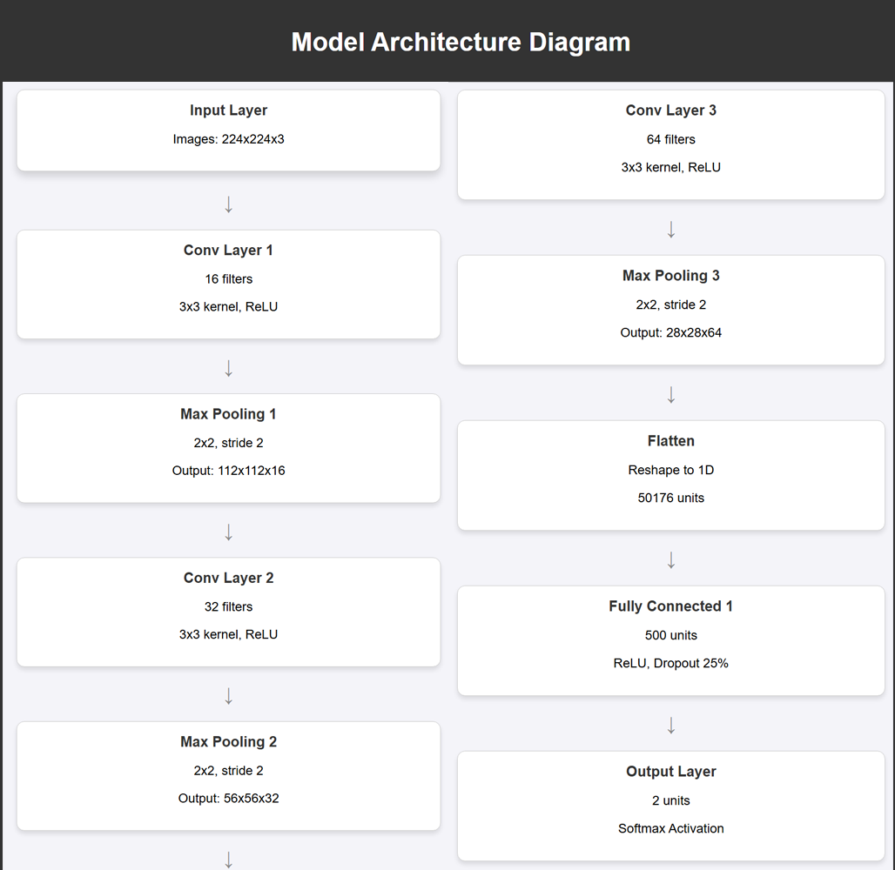

# Tire Condition Classifier
This repository contains a machine learning project aimed at classifying the condition of car tires as **Good** or **Defective** using convolutional neural networks (CNNs) and transfer learning with VGG16.



## Motivation
Tire safety is critical to preventing accidents caused by worn-out or defective tires. This project automates tire condition assessment using image-based analysis, helping users make timely maintenance decisions.

## Dataset
The dataset was sourced from the [Tire Quality Classification dataset on Kaggle](https://www.kaggle.com/datasets/warcoder/tyre-quality-classification). It consists of 1,854 images labeled as **Good** or **Bad**, with preprocessing and augmentation applied to enhance the model's robustness.

## Network Architectures
### Base CNN
A custom 3-layer CNN designed for feature extraction and classification:
- 16, 32, and 64 filters with 3x3 kernels.
- Max pooling after each layer.
- Fully connected layers with dropout (25%).

### VGG16 Transfer Learning
The VGG16 model, pre-trained on ImageNet, fine-tuned for binary classification:
- Frozen convolutional layers.
- Replaced the final fully connected layer with a binary classifier.


### Data Augmentation
To improve generalization, the following techniques were applied:
- Random horizontal flips.
- Rotations (±10 degrees).
- Color jittering (brightness, contrast, saturation).
- Affine transformations.

## Results
| Model          | Augmentation | Accuracy |
|-----------------|--------------|----------|
| Base CNN       | No           | 72%      |
| Base CNN       | Yes          | 80%      |
| VGG16          | Yes          | 95%      |

## How to Build and Run
Clone this repository and install the dependencies:

```bash
git clone https://github.com/joseantoniormc/tire-condition-classifier.git
cd tire-condition-classifier
pip install -r requirements.txt
